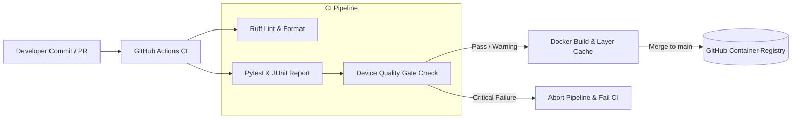

# Android Device Quality CI/CD Pipeline

[](https://github.com/rehan/android-device-quality-cicd/actions/workflows/ci.yml)
[](https://www.python.org/downloads/)
[](https://github.com/astral-sh/ruff)
[](https://docs.pytest.org/)
[](https://hub.docker.com/_/python)
[](https://github.com/features/packages)

A lightweight, production-grade **Android Device Quality Simulator and CI/CD Pre-Flight Quality Gate** written in modern Python 3.12. 

This repository demonstrates industry-standard **DevOps, SDET, Docker containerization, strict Ruff linting, Pytest automation, and GitHub Actions CI/CD pipeline** engineering practices.

---

## Why This Project Exists

In enterprise mobile engineering, automated test execution against real physical Android devices (or cloud device farms like Firebase Test Lab, AWS Device Farm, or in-house USB device racks) is slow, resource-constrained, and expensive. Running long UI test suites on devices with:
- **Low battery** (< 10%) risks sudden device shutdown mid-run, corrupting ADB server state.
- **Extreme thermal throttling** (> 48°C) skews latency benchmarks and damages hardware.
- **Near-full storage** (> 95%) causes APK installation failures (`INSTALL_FAILED_INSUFFICIENT_STORAGE`).
- **Unbooted or unauthorized ADB status** causes indefinite hangs in test runners.

Standard CI runners (such as GitHub-hosted `ubuntu-latest`) do not have physical Android hardware attached. This project provides a **deterministic Device Quality Simulator** that ingests device telemetry, performs rigorous health checks against calibrated thresholds, determines an overall status (`HEALTHY`, `WARNING`, `CRITICAL`), and acts as an automated quality gate:



---

## Architecture & System Design

```
+---------------------------------------------------------------------------------+
|                                 Caller / CI Tool                                |
|          (CLI: python -m device_quality.runner  OR  REST/JSON Payload)          |
+---------------------------------------------------------------------------------+
                                         |
                                         v
+---------------------------------------------------------------------------------+
|                       Device Telemetry Ingestion & Validation                   |
|                       [device_quality.device.Device]                           |
|  - Range checks: Battery (0-100%), Storage (0-100%), Temperature (-20 to 100°C) |
|  - Schema checks: ConnectionStatus (CONNECTED, etc.), BootStatus (BOOTED, etc.) |
+---------------------------------------------------------------------------------+
                                         |
                                         v
+---------------------------------------------------------------------------------+
|                         Health Evaluation Engine                                |
|                   [device_quality.health.HealthEvaluator]                       |
|  - Evaluates battery, storage, thermal, connection, and boot metrics            |
|  - Applies strict severity ranking: CRITICAL > WARNING > HEALTHY                |
|  - Computes is_eligible_for_testing flag and records rejection reasons         |
+---------------------------------------------------------------------------------+
                                         |
                       +-----------------+-----------------+
                       |                                   |
         [Eligible: HEALTHY / WARNING]              [Ineligible: CRITICAL]
                       |                                   |
                       v                                   v
+---------------------------------------------+   +-------------------------------+
|             Simulation Runner               |   |          Gate Blocked         |
|     [device_quality.runner.QualityRunner]   |   |  - Skip test execution        |
|  - test_os_environment                     |   |  - Record failure diagnosis   |
|  - test_storage_allocation                  |   |  - Return Exit Code 1         |
|  - test_thermal_stability                   |   +-------------------------------+
|  - test_app_launch_readiness                |                   |
+---------------------------------------------+                   |
                       |                                          |
                       v                                          v
+---------------------------------------------------------------------------------+
|                    Machine-Readable JSON Artifact Output                        |
|                     (Passed: Exit 0  |  Failed: Exit 1)                         |
+---------------------------------------------------------------------------------+
```

---

## Health Quality Thresholds

| Metric | HEALTHY | WARNING | CRITICAL (Gate Blocks) |
|---|---|---|---|
| **Connection Status** | `CONNECTED` | — | `DISCONNECTED`, `UNAUTHORIZED` |
| **Boot Status** | `BOOTED` | — | `BOOTING`, `RECOVERY`, `OFFLINE` |
| **Battery Level** | $\ge 20.0\%$ | $10.0\% - 19.9\%$ | $< 10.0\%$ |
| **Operating Temp** | $\le 40.0^\circ\text{C}$ | $40.1^\circ\text{C} - 48.0^\circ\text{C}$ | $> 48.0^\circ\text{C}$ |
| **Storage Utilization** | $\le 85.0\%$ | $85.1\% - 95.0\%$ | $> 95.0\%$ |

*Rule:* A single `CRITICAL` check immediately causes the overall health status to evaluate to `CRITICAL`, blocking test execution and exiting with code `1`. Multiple warnings aggregate to `WARNING` and allow test execution to proceed with diagnostic logs.

---

## Repository Structure

```
android-device-quality-cicd/
├── .github/
│   └── workflows/
│       └── ci.yml               # Industrial GitHub Actions CI/CD workflow
├── src/
│   └── device_quality/          # Core Python package (standard library only)
│       ├── __init__.py          # Public package API exports
│       ├── __main__.py          # Direct python -m device_quality entrypoint
│       ├── device.py            # Device data model, enums, schema validation
│       ├── health.py            # Health check evaluator, thresholds, aggregation
│       └── runner.py            # Pre-flight gate orchestrator & CLI interface
├── tests/
│   ├── __init__.py
│   ├── test_device.py           # Device validation, boundary, and error tests
│   ├── test_health.py           # Threshold boundaries, severity precedence tests
│   └── test_runner.py           # Runner, mock test cases, and CLI integration tests
├── Dockerfile                   # Lean, secure Python 3.12 slim container
├── .dockerignore                # Container build context filter
├── .gitignore                   # Version control exclusions
├── pyproject.toml               # PEP 517/621 build config, Ruff, and Pytest settings
├── requirements.txt             # Zero third-party runtime dependencies
├── requirements-dev.txt         # Development & CI tooling (pytest, ruff)
└── README.md                    # Project documentation & reference manual
```

---

## Technology Stack

- **Language:** Python 3.12+ (zero runtime third-party dependencies; uses `dataclasses`, `enum.StrEnum`, `typing`, `json`, `argparse`).
- **Testing:** Pytest 8.x with `--junitxml` test reporting.
- **Linting & Formatting:** Ruff (strict lint configuration enforcing `E`, `F`, `W`, `I`, `B`, `UP`, `SIM`, `C4` rules).
- **Containerization:** Docker (`python:3.12-slim`, non-root user `appuser:10001`, layer optimized).
- **CI/CD Orchestration:** GitHub Actions with Buildx, GitHub Actions layer caching (`cache-from: type=gha`), and automated GHCR publication.

---

## Local Setup & Development

### 1. Clone and Create Virtual Environment

```bash
git clone https://github.com/rehan/android-device-quality-cicd.git
cd android-device-quality-cicd

# Create and activate Python virtual environment
python -m venv .venv

# On Linux/macOS:
source .venv/bin/activate

# On Windows (PowerShell):
.venv\Scripts\Activate.ps1
```

### 2. Install Development Dependencies

```bash
pip install -r requirements-dev.txt
pip install -e .
```

---

## Running Quality Checks

### Run Automated Unit & Integration Tests

Execute the 71 comprehensive unit and boundary tests:

```bash
pytest -v
```

Generate a machine-readable JUnit XML report (as produced in CI):

```bash
pytest -v --junitxml=reports/test-results.xml
```

### Run Ruff Linter and Formatter

Verify code quality against strict Ruff rules:

```bash
# Check for lint violations
ruff check .

# Verify formatting style
ruff format --check .

# Automatically apply safe fixes and formatting
ruff check --fix .
ruff format .
```

---

## Command Line Interface (CLI)

The package provides an executable CLI entry point via `python -m device_quality.runner` or the installed console command `device-quality`.

### Built-in Presets

```bash
# Evaluate a healthy sample device (Exit code 0)
python -m device_quality --sample

# Evaluate a device with warning metrics (Exit code 0)
python -m device_quality --sample-warning

# Evaluate a critical device (Exit code 1, test suite blocked)
python -m device_quality --sample-critical
```

### File and Inline Telemetry Input

```bash
# Evaluate telemetry from a JSON file
python -m device_quality --file device_spec.json

# Evaluate inline JSON string
python -m device_quality --data '{"model":"Pixel 8","android_version":"14","battery_level":85,"storage_usage":40,"temperature":32,"connection_status":"CONNECTED","boot_status":"BOOTED"}'

# Export report directly to a file
python -m device_quality --sample --output reports/gate_report.json
```

---

## Example Health Evaluation Output

### Successful Evaluation (`HEALTHY` Device)

```json
{
  "timestamp": "2026-09-03T06:41:15.690835+00:00",
  "gate_passed": true,
  "test_suite_executed": true,
  "device": {
    "model": "Pixel 8 Pro",
    "android_version": "14.0",
    "battery_level": 85.0,
    "storage_usage": 42.0,
    "temperature": 31.5,
    "connection_status": "CONNECTED",
    "boot_status": "BOOTED"
  },
  "health_report": {
    "overall_status": "HEALTHY",
    "is_eligible_for_testing": true,
    "rejection_reasons": [],
    "warnings": [],
    "checks": [
      {
        "name": "connection_status",
        "status": "HEALTHY",
        "value": "CONNECTED",
        "threshold": "CONNECTED",
        "message": "Device is connected via simulated ADB."
      },
      {
        "name": "boot_status",
        "status": "HEALTHY",
        "value": "BOOTED",
        "threshold": "BOOTED",
        "message": "Device system server has completed boot sequence."
      },
      {
        "name": "battery_level",
        "status": "HEALTHY",
        "value": 85.0,
        "threshold": ">= 20.0%",
        "message": "Battery level is optimal (85.0%)."
      },
      {
        "name": "temperature",
        "status": "HEALTHY",
        "value": 31.5,
        "threshold": "<= 40.0°C",
        "message": "Device thermal profile is normal (31.5°C)."
      },
      {
        "name": "storage_usage",
        "status": "HEALTHY",
        "value": 42.0,
        "threshold": "<= 85.0%",
        "message": "Storage capacity is healthy (42.0% utilized)."
      }
    ]
  },
  "tests": [
    {
      "name": "test_os_environment",
      "status": "PASSED",
      "duration_ms": 45.2,
      "details": "Android 14.0 verified on Pixel 8 Pro."
    },
    {
      "name": "test_storage_allocation",
      "status": "PASSED",
      "duration_ms": 62.8,
      "details": "Storage capacity verified (58.0% free). Staging ready."
    },
    {
      "name": "test_thermal_stability",
      "status": "PASSED",
      "duration_ms": 88.4,
      "details": "Device operating at 31.5°C."
    },
    {
      "name": "test_app_launch_readiness",
      "status": "PASSED",
      "duration_ms": 115.0,
      "details": "ActivityManager and PackageManager responsive. Ready for UI tests."
    }
  ],
  "summary": {
    "gate_status": "PASSED",
    "overall_health": "HEALTHY",
    "tests_total": 4,
    "tests_passed": 4,
    "tests_failed": 0,
    "tests_skipped": 0,
    "total_duration_ms": 311.4
  }
}
```

### Blocked Evaluation (`CRITICAL` Device)

When a device fails critical thresholds (e.g. low battery 6.5%, overheating 52.3°C, unbooted state), the gate blocks testing immediately:

```json
{
  "timestamp": "2026-09-03T06:41:21.710606+00:00",
  "gate_passed": false,
  "test_suite_executed": false,
  "device": {
    "model": "Pixel 6a",
    "android_version": "13.0",
    "battery_level": 6.5,
    "storage_usage": 97.8,
    "temperature": 52.3,
    "connection_status": "DISCONNECTED",
    "boot_status": "BOOTING"
  },
  "health_report": {
    "overall_status": "CRITICAL",
    "is_eligible_for_testing": false,
    "rejection_reasons": [
      "Device connection status is 'DISCONNECTED'; required: CONNECTED.",
      "Device boot status is 'BOOTING'; required: BOOTED.",
      "Critical battery level: 6.5%. Insufficient power to sustain automated test suite.",
      "Critical thermal threshold exceeded: 52.3°C. Automated tests aborted to prevent damage.",
      "Critical storage utilization: 97.8% utilized. Insufficient space to install build APK."
    ],
    "warnings": [],
    "checks": [ ... ]
  },
  "tests": [],
  "summary": {
    "gate_status": "BLOCKED",
    "overall_health": "CRITICAL",
    "reason": "Device quality gate failed. Testing aborted: ...",
    "tests_total": 0,
    "tests_passed": 0,
    "tests_failed": 0,
    "tests_skipped": 0,
    "total_duration_ms": 0.0
  }
}
```

---

## Docker Containerization

The project includes a production-ready `Dockerfile` following container best practices:
- **Base image:** Official `python:3.12-slim` to minimize attack surface and image size.
- **Security:** Non-root execution (`appuser:10001`).
- **Environment:** `PYTHONDONTWRITEBYTECODE=1`, `PYTHONUNBUFFERED=1`.
- **Runtime entrypoint:** Runs the quality gate CLI by default.

### Build and Run with Docker

```bash
# Build the container image
docker build -t android-device-quality:latest .

# Run with default healthy sample device
docker run --rm android-device-quality:latest

# Run with critical sample (evaluates and returns exit code 1)
docker run --rm android-device-quality:latest --sample-critical

# Mount and evaluate local device configuration
docker run --rm -v "$(pwd)/device.json:/app/device.json:ro" \
  android-device-quality:latest --file /app/device.json
```

---

## CI/CD Pipeline Architecture (.github/workflows/ci.yml)

The automated GitHub Actions workflow implements an enterprise CI/CD release pipeline:

1. **Pull Request Validation:** Triggers on all pull requests targeting `main` branch.
2. **Push to Main:** Triggers on merges/pushes to `main`.
3. **Concurrency Control:** Cancels outdated workflow runs on subsequent branch commits (`cancel-in-progress: true`).
4. **Job 1: Linting (`lint`):**
   - Sets up Python 3.12.
   - Runs `ruff check .` for static analysis.
   - Runs `ruff format --check .` for code formatting compliance.
5. **Job 2: Testing (`test`):**
   - Sets up Python 3.12 and installs dev dependencies.
   - Executes `pytest -v --junitxml=reports/test-results.xml`.
   - Uploads JUnit XML test reports as a GitHub artifact with 14-day retention.
6. **Job 3: Container Build & Publish (`docker-build`):**
   - Dependent on `[lint, test]` (only runs if code quality and all tests pass).
   - Configures least-privilege security permissions (`contents: read, packages: write`).
   - Sets up Docker Buildx.
   - Authenticates securely to **GitHub Container Registry (GHCR)** using standard `${{ secrets.GITHUB_TOKEN }}` (no external credentials required).
   - Uses `docker/metadata-action@v5` to generate semantic tags:
     - Commit short SHA: `type=sha,prefix=,format=short`
     - Latest tag: `latest` (published strictly on `main` branch merges).
   - Leverages **GitHub Actions Layer Caching** (`cache-from: type=gha`, `cache-to: type=gha,mode=max`) for fast Docker builds.
   - Only pushes images when running on `refs/heads/main` (pull requests execute build validation without publishing).
7. **Branch Protection:** Ready for GitHub Branch Protection requiring the `lint` and `test` status checks to pass before merging.

---

## License

This project is open source and available under the [MIT License](LICENSE).
